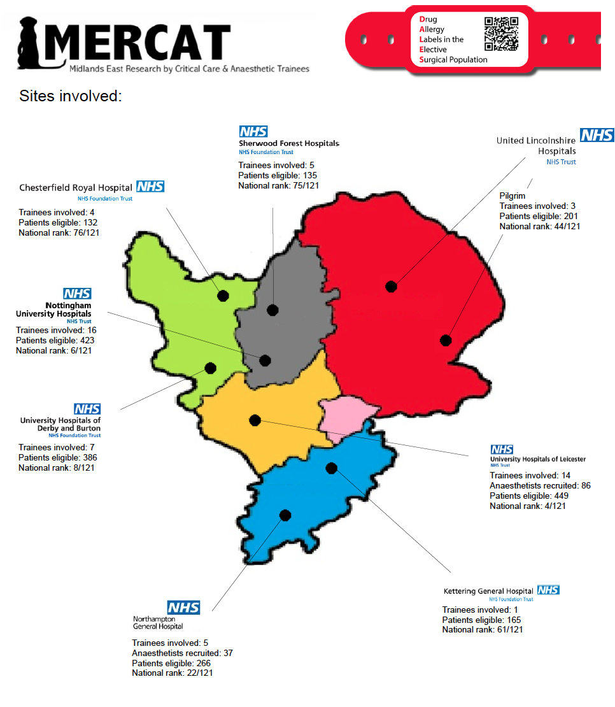

[DALES](https://www.raftrainees.org/raft-3-dales.html) was the 3rd RAFT national collaborative project involving all networks. DALES was a three-day study in mid-2018 comprising Patient Questionnaire, Anaesthetist Survey and Patient Follow-Up on the day, all aiming to assess how elective surgical patients were labelled with drug allergies, and the impact of this on anaesthetists' conduct.

Trainees from multiple sites across the East Midlands collected data for this great project, complementing this findings of [NAP6](https://www.nationalauditprojects.org.uk/NAP6home):

​

The results of the project were [published in the British Journal of Anaesthesia](​https://www.sciencedirect.com/science/article/abs/pii/S0007091220306413).
