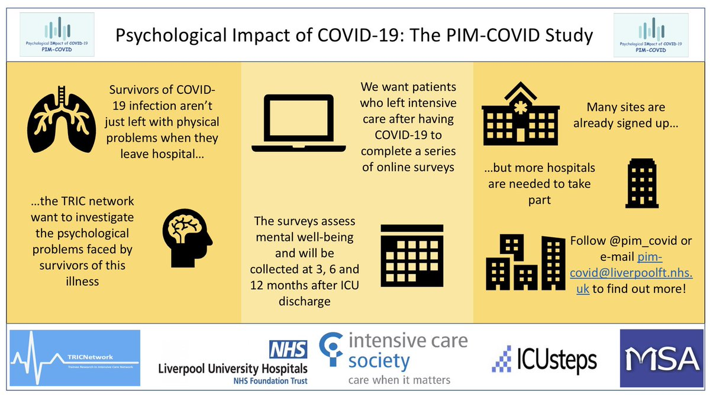

[PIM-COVID](https://twitter.com/pim_covid) is a follow up study assessing critical care survivors' quality of life and ongoing health needs. It's the first national project of the [TRIC Network](http://www.tricnetwork.co.uk/), and several sites across the East Midlands are already recruiting.

If you'd like to get involved, [contact Nick](/author/dr-nick-plummer/) for more information, and either join the team at your hospital or (even better) sign your Trust up. 
